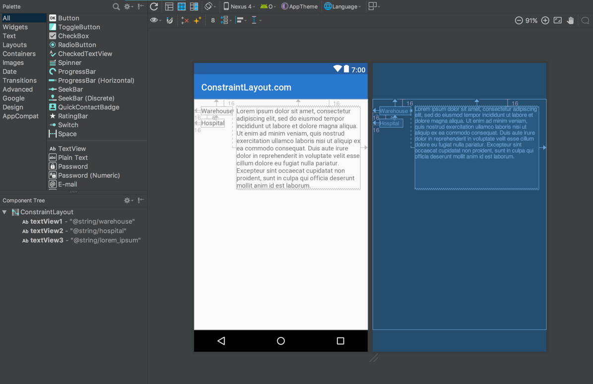
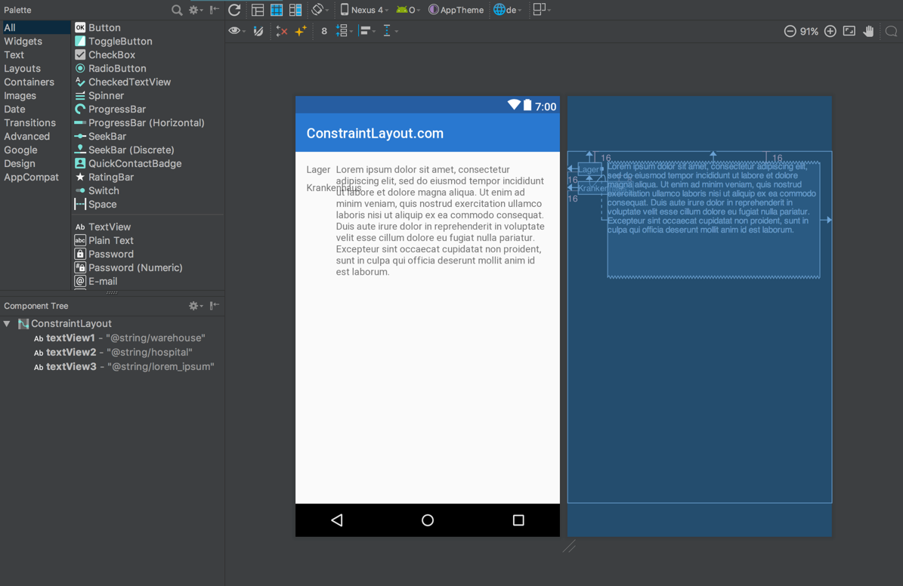
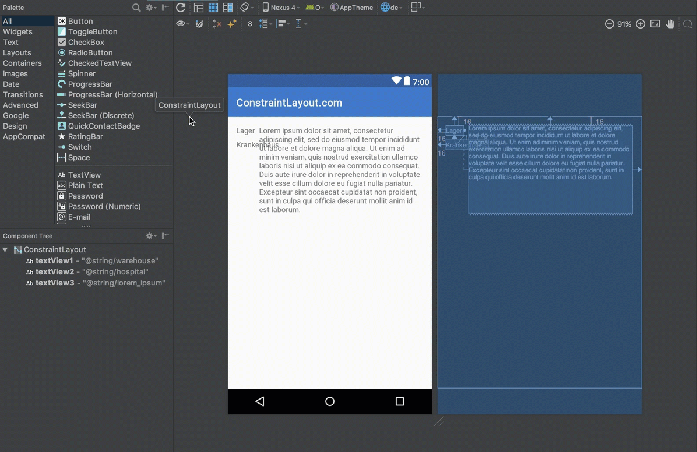
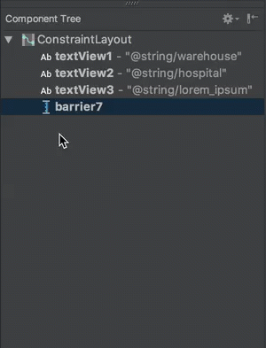
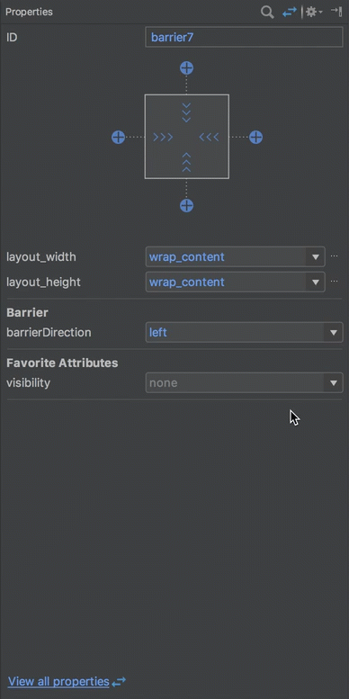
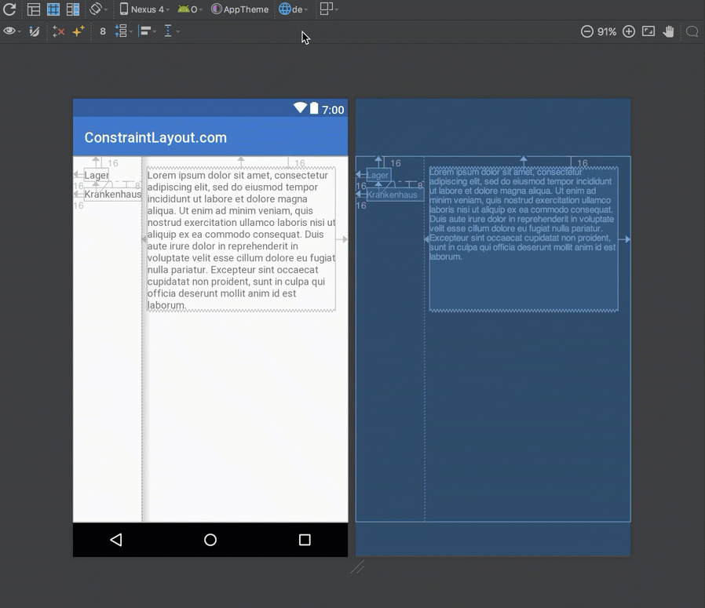

### Barriers

When we are creating Android layouts, sometimes we encounter situations where the layout can change depending on the localisation. Here is a really simple example:



Here we have three TextViews: `textView1` and `textView2` on the left; and `textView3` on the right. `textView3` has been constrained to the end of `textView1` and this works perfectly - it positions and sizes`textView3` exactly as we need it.
 
 However, things become more complicated if we need to support multiple languages. If we add a German translation then we have a problem because in the English version the text in `textView1` is longer than that in `textView2`, whereas in German the text in `textView2` is longer than that in `textView1`:
 
 

The problem here is that `textView3` is still constrained to `textView1` and so `textView2` is now running in to `textView3`. This is seen most clearly in the Design view (the one with the white background).
 
 The obvious solutions to this would be to either use `TableLayout`, or wrap `textView1` & `textView2` inside a vertical `LinearLayout` with `android:layout_width="wrap_content"` nd then constrain `textView3` to the end of this `LinearLayout`. But there is a better way: Barriers.
 
A `Barrier` is a virtual view, similar to a `Guideline`, to which we can constrain objects. The difference between a `Barrier` and a `Guideline` is that the position of a `Barrier` is determined by the dimensions of multiple views. In the case of our example, we don't know whether `textView1` or `textView2` will be wider, so we can create a `Barrier` based upon the widths of these two Views. Then we can constrain `textView3` to the `Barrier`.
 
### Creating Barriers in the editor
Setting up barriers requires a few steps. First we create a vertical barrier by selecting `Add Vertical Barrier` from the context menu:

 

You can see the `Barrier` that is added to the component tree (the lower left panel).
 
We can optionally change its position within the layout hierarchy by dragging it within the component tree:

 
 
 Next we need to set the direction fo the `Barrier`. In our case we want to position the `Barrier` relative to the `End` of either `textView1` or `textView2` depending on whichever is the larger, so we need to specify a direction of `end`:
 


The final step in defining the `Barrier` is to tell it which Views we need to position it relative to. We don't use a constraint here because a constraint is actually a one-to-one mapping, and here we have multiple Views. For a `Barrier` we need to define multiple Views as referenced IDs, which we can do by dragging them within the component tree:


These references are listed as children of the `Barrier` in the component tree once they have been defined. If you watch the Blueprint view (with the blue background) in that video, you will see the `Barrier` jumps in to position (the dotted vertical line which moves from the left edge) as the references are created.
 
Now that the `Barrier` has been defined, all that remains is to change the constraint of `textView3` to be relative to the `Barrier` rather than `textView1`:


`textView3` is positioned to the end of `textView2` once the constraint is changed.
 
 To see how this affects things overall, we can now toggle the language selection and see that the `Barrier` is now positioned to the end of whichever one of the referenced Views (`textView1` or `textView2`) is the wider:
 
 

### Creating Barriers in XML

The XML for this is actually pretty simple:

```xml
<?xml version="1.0" encoding="utf-8"?>
<android.support.constraint.ConstraintLayout 
  xmlns:android="http://schemas.android.com/apk/res/android"
  xmlns:app="http://schemas.android.com/apk/res-auto"
  android:layout_width="match_parent"
  android:layout_height="match_parent">

  <TextView
    android:id="@+id/textView1"
    android:layout_width="wrap_content"
    android:layout_height="wrap_content"
    android:layout_marginStart="16dp"
    android:layout_marginTop="16dp"
    android:text="@string/warehouse"
    app:layout_constraintStart_toStartOf="parent"
    app:layout_constraintTop_toTopOf="parent" />

  <TextView
    android:id="@+id/textView2"
    android:layout_width="wrap_content"
    android:layout_height="wrap_content"
    android:layout_marginStart="16dp"
    android:layout_marginTop="8dp"
    android:text="@string/hospital"
    app:layout_constraintStart_toStartOf="parent"
    app:layout_constraintTop_toBottomOf="@+id/textView1" />

  <android.support.constraint.Barrier
    android:id="@+id/barrier7"
    android:layout_width="wrap_content"
    android:layout_height="wrap_content"
    app:barrierDirection="end"
    app:constraint_referenced_ids="textView2,textView1" />

  <TextView
    android:id="@+id/textView3"
    android:layout_width="0dp"
    android:layout_height="wrap_content"
    android:layout_marginStart="8dp"
    android:text="@string/lorem_ipsum"
    app:layout_constraintStart_toEndOf="@+id/barrier7"
    app:layout_constraintTop_toTopOf="parent" />

</android.support.constraint.ConstraintLayout>
```

The only thing specific to `Barrier` is the `Barrier` element itself. The `app:barrierDirection` attribute determines the direction of the `Barrier` - in this case it will be positioned at the `end` of the referenced Views.

The list of referenced Views is a comma separated list of the IDs of other Views within the layout (without the `@+id/` qualifier).