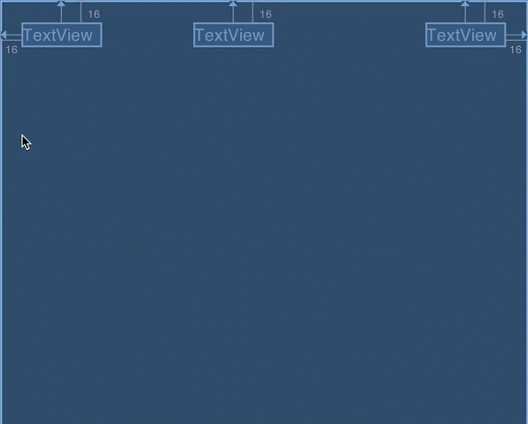
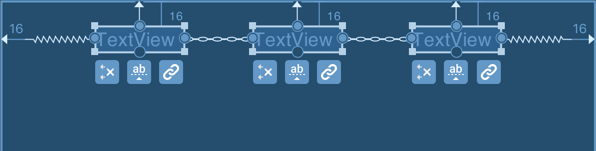
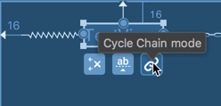
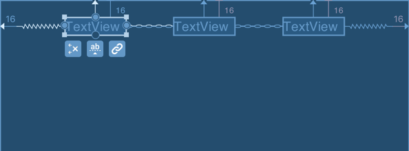
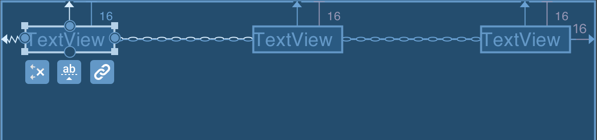
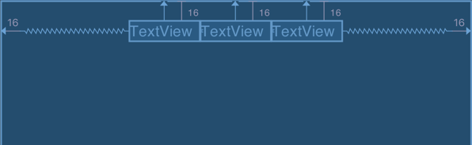
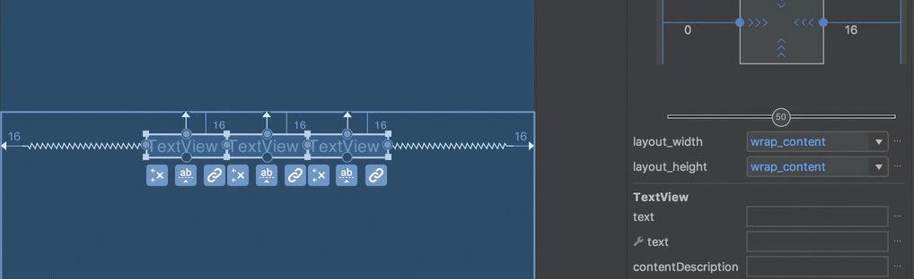
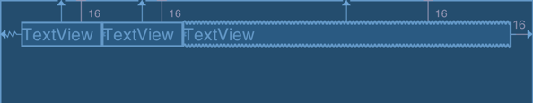
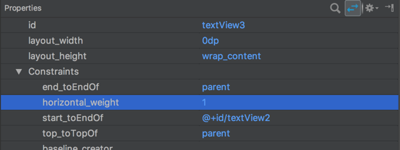
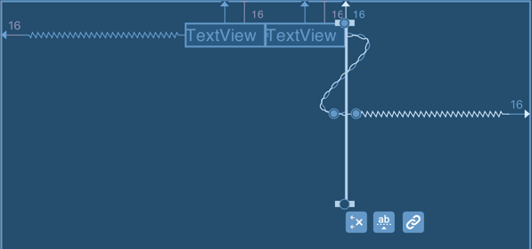

### What are chains?
Chains are a specific kind of constraint which allow us to share space between the views within the chain and control
how the available space is divided between them. The closest analogue with traditional Android layouts is weights in
`LinearLayout`, but chains do far more than that, as we shall see.

#### Creating a chain
As we have already mentioned, a chain consists of multiple views, so to create a chain we must select the views we
wish to chain together, and then select either 'Center Horizontally' to create a horizontal chain, or 
'Center Vertically' to create a vertical chain. Let's create a horizontal chain from three views:
 
 
 
 The first thing worth mentioning is that the two views at the ends of the chain (in this case the leftmost and 
 rightmost views) already have constraints from their left & right edges respectively, to the parent. The creation 
 of the chain simply defines the inter-relationships of the members of the chain. If we look at the chain that we
 have just created, there are a couple of visual representations that are worth explaining:
 


Firstly note that the two connections between the views resemble a chain (these are the chain constraints which we have just 
created), and the outer two connections (between the leftmost and rightmost views and the parent) resemble springs.
These outermost connections denote the "chain mode" which has been applied to the chain. The "chain mode" specifies
how the chain will fill the available space, and we can cycle between the three available modes using the "cycle chain 
mode" button which appears below all of the members of the chain:



There are three possible modes: `spread`, `spread_inside`, and `packed`.

##### Spread Chain
The default mode is `spread` mode, and this will position the views in the chain at even intervals within the 
available space:



##### Spread Inside chain
The next mode is `spread_inside` which snaps the outermost views in the chain to the outer edges, and then positions 
the remaining views in the chain at equal intervals within the available space:



#### Packed Chain
The final mode is `packed` which will pack the views together (although you can provide margins to separate them 
slightly), and then centres the group within the available space: 



With a packed chain, the positioning of the packed views can be further controlled by altering the `bias` value - in this
example the `bias` is set to `0.5` which will centre things. But altering this value can change the position of the 
packed chain:



#### Spread Chain Weights
One really useful feature of both `spread` and `spread_inside` chains is that we can apply weights to individual 
members of the chain and we get very similar behaviour to weights in `LinearLayout`. Currently there is no direct 
way of doing this in the editor, but we can use the properties view to change attributes manually.



To apply a weight to a specific `View` we must first select the `View` in the editor, and then 
(if the `View` is in a horizontal chain) specify a `android:layout_width="0dp"` and 
`app:layout_constraintHorizontal_weight="1"`:



Note how the appearance of the `View` changes in the blueprint view - the top and bottom edges change from straight lines 
in to become accordion-like - this gives a visual indication of a weighted `View`.

It is also worth noting that weights do not play nicely if we try to use them in `packed` mode. Whereas `spread` and
`spread_inside` modes will use as much space as they need, `packed` mode will try and pack things in to the smallest 
possible space. If you attempt to use weights in a `packed` chain then the weighted views will shrink to zero size:
 


#### Chains in XML
It would be reasonable to assume that dedicated attributes exist in order to specify chains in XML, but this is
not, in fact, the case. Instead the existing constraint attributes are combined. 
To create chains in XML the chain constraints are simply two way, complementary constraints. Here is the XML for the 
initial chain creation that we looked at earlier:

```xml
<?xml version="1.0" encoding="utf-8"?>
<androidx.constraintlayout.widget.ConstraintLayout
  xmlns:android="http://schemas.android.com/apk/res/android"
  xmlns:app="http://schemas.android.com/apk/res-auto"
  xmlns:tools="http://schemas.android.com/tools"
  android:layout_width="match_parent"
  android:layout_height="match_parent"
  tools:context="com.stylingandroid.scratch.MainActivity">

  <TextView
    android:id="@+id/textView"
    android:layout_width="wrap_content"
    android:layout_height="wrap_content"
    android:layout_marginStart="16dp"
    android:layout_marginTop="16dp"
    app:layout_constraintEnd_toStartOf="@+id/textView2"
    app:layout_constraintHorizontal_chainStyle="spread"
    app:layout_constraintStart_toStartOf="parent"
    app:layout_constraintTop_toTopOf="parent"
    tools:text="TextView" />

  <TextView
    android:id="@+id/textView2"
    android:layout_width="wrap_content"
    android:layout_height="wrap_content"
    android:layout_marginTop="16dp"
    app:layout_constraintEnd_toStartOf="@+id/textView3"
    app:layout_constraintStart_toEndOf="@+id/textView"
    app:layout_constraintTop_toTopOf="parent"
    tools:layout_editor_absoluteX="141dp"
    tools:text="TextView" />

  <TextView
    android:id="@+id/textView3"
    android:layout_width="wrap_content"
    android:layout_height="wrap_content"
    android:layout_marginEnd="16dp"
    android:layout_marginTop="16dp"
    app:layout_constraintEnd_toEndOf="parent"
    app:layout_constraintStart_toEndOf="@+id/textView2"
    app:layout_constraintTop_toTopOf="parent"
    tools:text="TextView" />

</androidx.constraintlayout.widget.ConstraintLayout>
```

On `textView` there is `app:layout_constraintEndToStartOf="@+id/textView2"`; and on `textView2` there is 
`app:layout_constraintStart_toEndOf="@+id/textView"` - essentially creating two constraints between the same pair of 
anchor points in opposite directions. It is this which defines a chain.

Also on `textView` there is `app:layout_constraintHorizontal_chainStyle="spread"` which specifies the `spread` mode; you
can manually set this to `spread_inside` or `packed` to specify different chain modes. This must always be done on the 
`View` at the head of the chain - in other words the first item in the chain.
 
We can set a bias on the chain by setting `app:layout_constraintHorizontal_bias="0.75"` with a value between 
`0.0` - `1.0`.

Finally, we can define weights by specifying `android:layout_width="0dp"` and then 
`app:layout_constraintHorizontal_weight="1"`. 
