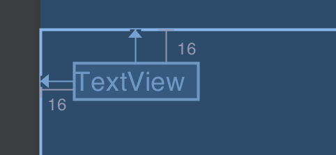
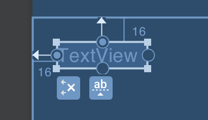
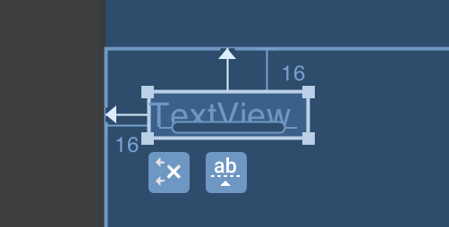
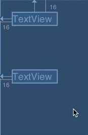
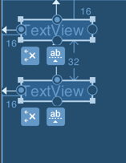
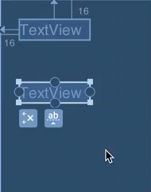
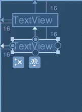

### What are constraints?

The fundamental building block of `ConstraintLayout` is creating constraints. A constraint defines a relationship between
two widgets in the layout and controls how those widgets will be positioned within the layout. For those new to
`ConstraintLayout`, but familiar with `RelativeLayout` the basic principles of how constraints work are very similar
to how we create relationships between widgets in `RelativeLayout`.

### Creating constraints in the editor
The easiest way to learn how to create constraints is using the visual editor in Android Studio. All of the examples
here will show how the blueprint view represents things. Let's start by looking at a simple `TextView` in the blueprint
view:



The `TextView` should be fairly obvious, and the two arrows show some existing constraints on this `TextView` which
align the left and top edges to the parent `ConstraintLayout`. We'll look at how to create them in a little while. We
can also see the 16dp margins which will add some space between the parent `ConstraintLayout` and the bounds of the
`TextView`. If we select the `TextView` we will see the sizing and anchor points:



The squares on the corners are the size handles and we can drag these to resize the `TextView`. These are not as
useful as they may first appear because using them will result in a fixed size of the `TextView` and we will normally
want the `TextView` to be sized responsively in some way.

The circles in the middle of each edge are the anchor points, and are used to create constraints.
The anchor points on the left and top edges contain a blue circle which indicates that a constraint has been defined
for this anchor point; and the ones on the right and bottom edge are empty which indicates that no constraint has been
defined for them. So we can see how the position of the `TextView` has been defined by aligning the top and left edges
to the parent.

Any `View` which subclasses `TextView` will also have an additional type of anchor point: the baseline. This enables
us to align the baseline of the text in the `TextView` as well. We can view this by clicking the 'ab' button below
the `TextView`:



The sausage-like shape is the baseline anchor point and we can create constraints from this in exactly the same way
as we are about to see with the four edge anchor points.

The other button below the `TextView` (the one containing the 'x') will remove all constraints.

To create a constraint we simply need to grab an anchor point of one `View`, and drag it to one of the anchor point of
another `View`. Here we have added a second `TextView` (with ID `textView2`) which has a left constraint to the parent,
and we create a new constraint from its top to the bottom of the first `TextView` (which has ID `textView`).
This will position the second `TextView` below the first one:



One thing worth noting is that while we have created a constraint from the top of `textView2` to the bottom of
`textView`, if we select both of the `TextView` instances then we only see a constraint is attached to the top of
`textView2` and there is no constraint associated with `textView` (the bottom anchor point of `textView` is still
empty):



The reason for this is that constraints are one way (unless we're talking about chains, which are a special case). So
the constraint in question is attached to `textView2`, and will position it relative to `textView`.
Since it is only attached to `textView2`, it has no direct influence on where `textView` is positioned.

Now that we know how to create a constraint between `Views` how do we go about creating a constraint to the parent
layout itself? That is simply a case of dragging the anchor point to the appropriate edge of the parent:



### Creating constraints in XML

For those who like to understand what's going on under the bonnet/hood, then the XML for that layout is:

```xml
<?xml version="1.0" encoding="utf-8"?>
<android.support.constraint.ConstraintLayout
  xmlns:android="http://schemas.android.com/apk/res/android"
  xmlns:app="http://schemas.android.com/apk/res-auto"
  xmlns:tools="http://schemas.android.com/tools"
  android:layout_width="match_parent"
  android:layout_height="match_parent"
  tools:context=".MainActivity">

  <TextView
    android:id="@+id/textView"
    android:layout_width="wrap_content"
    android:layout_height="wrap_content"
    android:layout_marginStart="16dp"
    android:layout_marginTop="16dp"
    app:layout_constraintLeft_toLeftOf="parent"
    app:layout_constraintTop_toTopOf="parent"
    tools:text="TextView" />

  <TextView
    android:id="@+id/textView2"
    android:layout_width="wrap_content"
    android:layout_height="wrap_content"
    android:layout_marginStart="16dp"
    android:layout_marginTop="8dp"
    app:layout_constraintLeft_toLeftOf="parent"
    app:layout_constraintTop_toBottomOf="@+id/textView"
    tools:text="TextView" />
</android.support.constraint.ConstraintLayout>
```

The constraints are the attributes which begin with `app:layout_constraint`. We can see those on all child views of the
`ConstraintLayout`, positioning them relative to the parent. You will also notice that `textView2` specifies a
constraint that the top of the view should be positioned relative to the bottom of `textView`.

It is worth noting that these are in the `app` namespace because `ConstraintLayout` is imported as a library so, like
the support libraries, it becomes part of your app rather than the Android framework (which uses the `android`
namespace).

#### Deleting a constraint
The final thing we'll cover here is how to delete a constraint. If you're working directly with the XML, it is simply
a case of deleting the attribute itself. If you're using the visual editor, you can delete a constraint by clicking
its anchor point:


