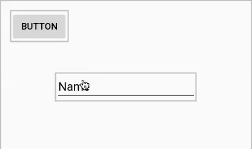
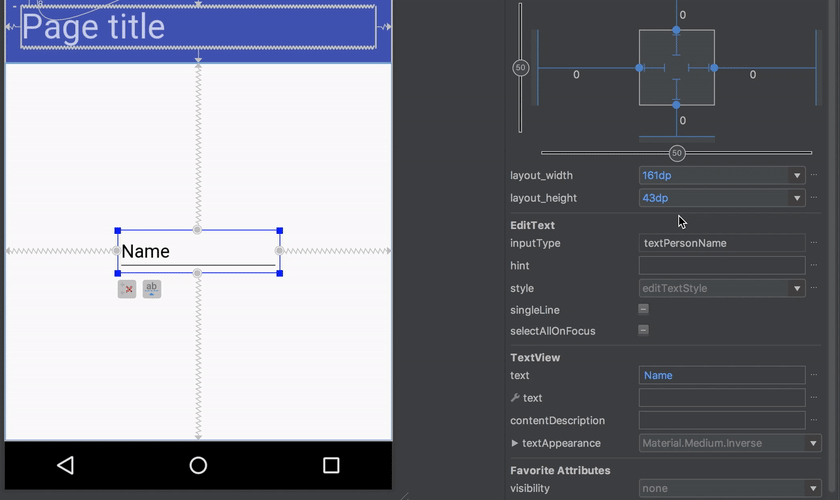
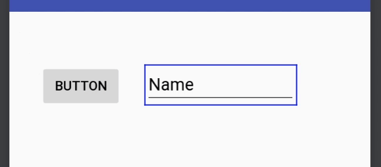

### Behaviour
A `RelativeLayout` is used to layout views based on some forms of relations each have relative to the other. If this sounds familiar, it is because a `RelativeLayout` is basically a more basic version of a `ConstraintLayout`, and many of the concepts of the latter map directly to `RelativeLayout`. In fact, one can think of a `ConstraintLayout` as a `RelativeLayout` on steroids; this is a good mental model to use to get acquainted to `ConstraintLayout` if you have experience using the "old-school" Android layouts.

### In the editor
Since the `RelativeLayout` is all about the relations between views, creating the corresponding constraints is as easy as literally creating the same relations you want. For example, to create an "X is above Y" constraint, which would be expressed by a `android:layout_above` attribute:

### Layout attributes equivalents
Given how close the `RelativeLayout` features are conceptually to the basics of `ConstraintLayout`, you can read up on [how to create constraints](../basics/create_constraint.md) and use the following lookup tables to translate from the `RelativeLayout` attributes language.

#### Positioning relative to the parent

 `RelativeLayout` attribute | `ConstraintLayout` attribute
 --- | ---
 `android:layout_alignParentLeft="true"` | `app:layout_constraintLeft_toLeftOf="parent"`
 `android:layout_alignParentStart="true"` | `app:layout_constraintStart_toStartOf="parent"`
 `android:layout_alignParentTop="true"` | `app:layout_constraintTop_toTopOf="parent"`
 `android:layout_alignParentRight="true"` | `app:layout_constraintRight_toRightOf="parent"`
 `android:layout_alignParentEnd="true"` | `app:layout_constraintEnd_toEndOf="parent"`
 `android:layout_alignParentBottom="true"` | `app:layout_constraintBottom_toBottomOf="parent"`
 `android:layout_centerHorizontal="true"` | `app:layout_constraintStart_toStartOf="parent"` and `app:layout_constraintEnd_toEndOf="parent"`
 `android:layout_centerVertical="true"` | `app:layout_constraintTop_toTopOf="parent"` and `app:layout_constraintBottom_toBottomOf="parent"`
 `android:layout_centerInParent="true"` | `app:layout_constraintStart_toStartOf="parent"`, `app:layout_constraintTop_toTopOf="parent"`, `app:layout_constraintEnd_toEndOf="parent"`, and `app:layout_constraintBottom_toBottomOf="parent"`

 
Note that there is no 1:1 equivalent for centering in the parent; instead, the same effect is obtained by setting equivalent and symmetrical constraints to the parent's edges. Centering horizontally then means having a couple of identical constraints towards the left and right edges of the parent, and centering vertically means constraining to the parent's top and bottom. Centering in both directions is simply a matter of having all four constraints. Notably, by setting a bias on the vertical and horizontal constraints you can align the view to a specific percentage to the parent:

#### Positioning relative to other views edges and baseline

 `RelativeLayout` attribute | `ConstraintLayout` attribute
 --- | ---
 `android:layout_toLeftOf` | `app:layout_constraintRight_toLeftOf`
 `android:layout_toStartOf` | `app:layout_constraintEnd_toStartOf`
 `android:layout_above` | `app:layout_constraintBottom_toTopOf`
 `android:layout_toRightOf` | `app:layout_constraintLeft_toRightOf`
 `android:layout_toEndOf` | `app:layout_constraintStart_toEndOf`
 `android:layout_below` | `app:layout_constraintTop_toBottomOf`
 `android:layout_alignLeft` | `app:layout_constraintLeft_toLeftOf`
 `android:layout_alignStart` | `app:layout_constraintStart_toStartOf`
 `android:layout_alignTop` | `app:layout_constraintTop_toTopOf`
 `android:layout_alignRight` | `app:layout_constraintRight_toRightOf`
 `android:layout_alignEnd` | `app:layout_constraintEnd_toEndOf`
 `android:layout_alignBottom` | `app:layout_constraintBottom_toBottomOf`
 `android:layout_alignBaseline` | `app:layout_constraintBaseline_toBaselineOf`

 
Note that additional constraint are possible in `ConstraintLayout` than were possible in `RelativeLayout`, such as aligning a baseline to another view's top or bottom edges. Those are not listed here because they don't have an equivalent in `RelativeLayout` attributes.

#### Constraints against `GONE` views

One `RelativeLayout` attribute that has no `ConstraintLayout` equivalent is `android:layout_alignWithParentIfMissing`. In a `RelativeLayout`, that attribute would cause the view to apply the alignment specified by the attibutes to the parent instead of to the target view when the latter is `GONE`. For example, a view A that is aligned `toRightOf` another view (which we'll call B) will go and align to the left edge of their parent if B is `GONE`.

`ConstraintLayout`, contrary to `RelativeLayout` and most other layouts, still considers and positions `GONE` views, so constraints to them are valid even when the views disappear. The only gotcha is that once a view becomes `GONE`, its width and height are fixed to `0dp`, and their margins are ignored.

To cope with potential lack of margins in these cases, `ConstraintLayout` offers the `app:layout_goneMargin[Left|Start|Top|Right|End|Bottom]` which can be used to specify a margin on a view in the case the constraint is attached to a `GONE` view. In this case, when the button is `GONE`, the `24dp` margin on the `start_toEndOf` that the text field has is replaced by the `app:layout_marginGoneStart="56dp"`:

